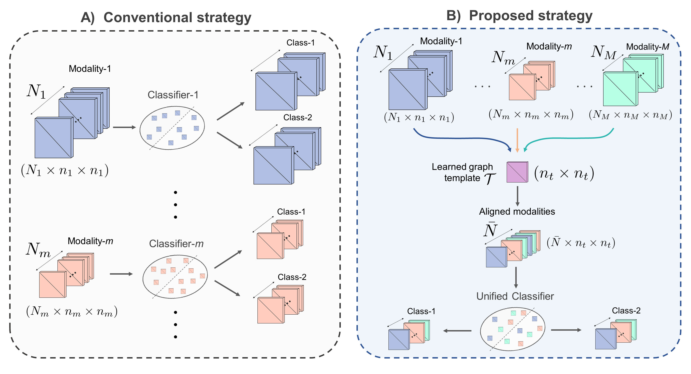
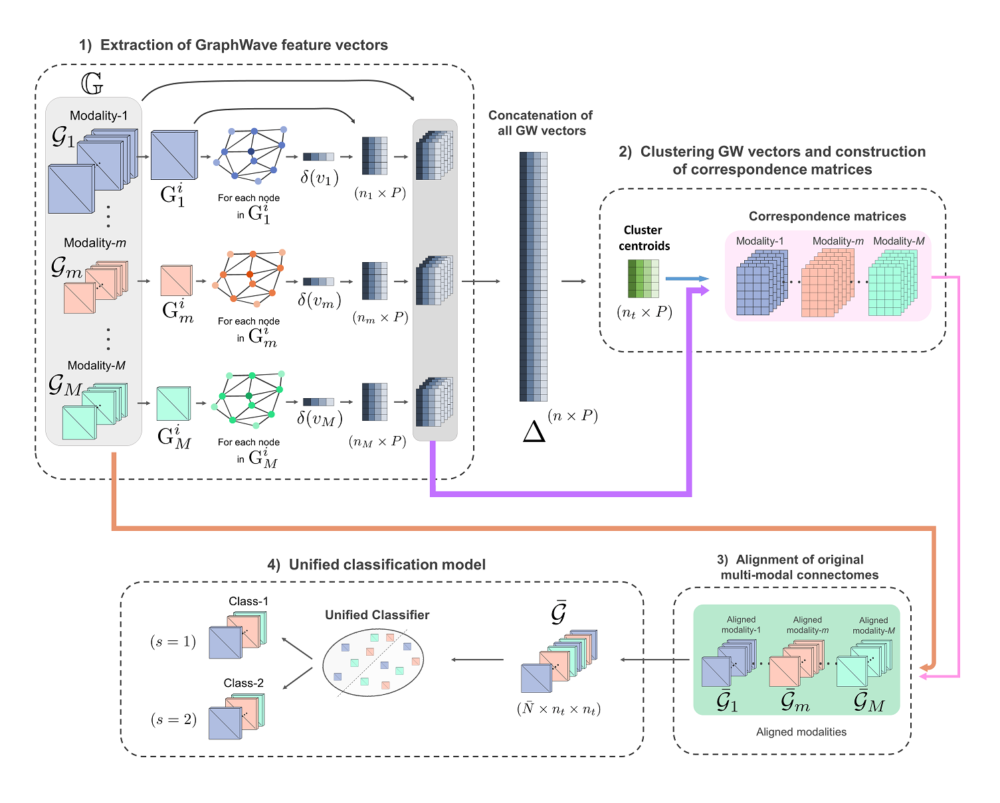
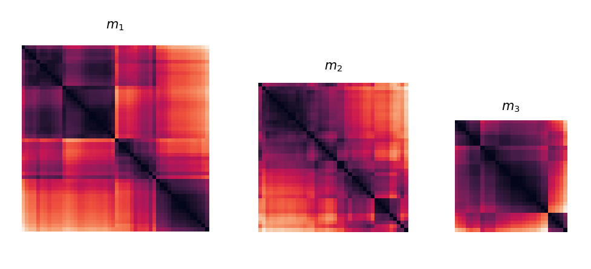
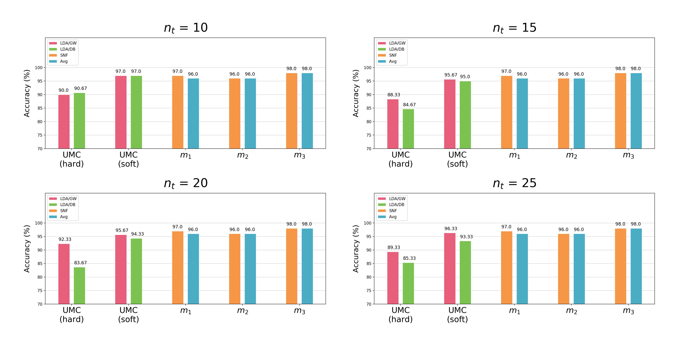

# UMC (Unified Multi-modal Classification)
UMC (Unified Multi-modal Classification) model for classifying heterogeneous (multi-modal and multi-sized) graphs, coded up in Python by Abdullah Yalçın (abdullahyalcin0508@gmail.com)

> **A diagnostic unified classification model for classifying multi-sized and multi-modal brain graphs using graph alignment**
> [Abdullah Yalçın](https://github.com/yalcina)<sup>1</sup>, [Islem Rekik](https://basira-lab.com/)<sup>1</sup>
> <sup>1</sup>BASIRA Lab, Faculty of Computer and Informatics, Istanbul Technical University, Istanbul, Turkey
>
> **Abstract:** *Presence of multimodal brain graphs derived from different neuroimaging modalities is inarguably one of the most critical challenges in building unified classification models that can be trained and tested on any brain graph regardless of its size and the modality it was derived from. One solution is to learn a model for each modality independently, which is cumbersome and becomes more time-consuming as the number of modalities increases. Another traditional solution is to build a model inputting multimodal brain graphs for the target prediction task; however, this is only applicable to datasets where all samples have joint neuro-modalities. In this paper, we propose to build a unified brain graph classification model trained on unpaired multimodal brain graphs, which can classify any brain graph of any size. This is enabled by incorporating a graph alignment step where all multi-modal graphs of different sizes and heterogeneous distributions are mapped to a common template graph. Next, we design a graph alignment strategy to the target fixed-size template and further apply linear discriminant analysis (LDA) to the aligned graphs as a supervised dimensionality reduction technique for the target classification task. We tested our method on unpaired autistic and healthy brain connectomes derived from functional and morphological MRI datasets (two modalities). Our results showed that our unified model method not only has great promise in solving such a challenging problem but achieves comparable performance to models trained on each modality independently.*



# Detailed proposed framework pipeline
This work has been published in the Journal of Neuroscience Methods, 2021. UMC is a novel framework to jointly classify multi-source and heterogeneous graphs. It consists of 4 main steps. (1) Extraction of feature vector embeddings using two different strategies: *depth-based* representation of each node in all graphs based on their local neighborhoods [(Bai et al., 2019)](https://link.springer.com/chapter/10.1007/978-3-030-46150-8_28) and *graph-wave* node embeddings via diffusion wavelets [(Donnat et al., 2018)](https://dl.acm.org/doi/10.1145/3219819.3220025), (2) Clustering feature vectors into *n<sub>t</sub>* clusters, each of which represents a node in the template graph to estimate, (3) Alignment of each graph from all modalities to the target template graph, (4) Training a linear classifier using the fixed-sized aligned brain graphs.



# Python and Libraries
* [Python 3.7+](https://www.python.org/)
* [Numpy 1.16+](https://numpy.org/)
* [Scipy 1.2+](https://www.scipy.org/)
* [Scikit-learn 0.21+](https://scikit-learn.org/stable/)
* [Networkx 2.3+](https://networkx.org/)
* [SNF 0.2+](https://pypi.org/project/snfpy/)
* [Matplotlib 3.1+](https://matplotlib.org/)

# Variable Hierarchy in UMC Codes

In the codes, multi-modal graphs and associated labels/matrices are processed or generated at 3 levels. ***x_i*** denotes *i*-th graph/label/feature/correspondence matrix in modality-*m*, ***X_m*** denotes a list of *N* ***x_i***'s in modality-*m* and ***All_X*** indicates a list of *M* ***X_m***'s (see the first image for the multi-modal dataset structure).

*Example structure*:
```
All_Graphs    ->  Graphs_m    ->  graph_i
All_Labels    ->  Labels_m    ->  label_i
All_Features  ->  Features_m  ->  feat_i
All_Corr      ->  Corr_m      ->  corr_i
```

# Running UMC
### Simulated Data

To simulate brain graphs, we created 3 pairs of *prototype graphs* which represent 3 neuroimaging modalities. Each pair can be regarded as the centers of the 2 classes (e.g, *ASD* & *NC* groups) in a modality of interest. Then, we slightly perturbed these prototype graphs to get 100 random samples (graphs) per modality. Each modality is perfectly balanced (class-1: 50, class-2: 50) for this case. Graph sizes (i.e, number of nodes or *resolution*) for modalities are *n<sub>1</sub>*=50, *n<sub>2</sub>*=40 and *n<sub>3</sub>*=30, respectively.

Multi-modal dataset:
* Modality-1 with shape (100 x 50 x 50)
* Modality-2 with shape (100 x 40 x 40)
* Modality-3 with shape (100 x 30 x 30)



### Demo-1

To test our *UMC* code with selected hyperparameters, you can run "Demo1.py" which consists of main function (*UMC*) of the proposed method. You need to provide the multi-modal dataset along with class labels and the necessary model parameters. The function *UMC()* returns single *Accuracy/Sensitivity/Specificity* score triple.

Parameters:
* `All_Graphs`:   Multi-modal graph dataset
* `All_Labels`:   Associated class labels
* `nt`:           Number of nodes in a template graph to estimate or number of cluster centroids in clustering step
* `feat_method`:  'GW' or 'DB' for the feature extraction method to select (i.e, Graph-Wave & Depth-based)
* `P`:            Length of DB vectors if `feat_method` = 'DB'
* `d`:            Number of time points for calculating GW vectors if `feat_method` = 'GW' (length: 2\*d)
* `eta`:          Scaling parameter for diffusion amount used in GW vector extraction (if `feat_method` = 'GW')
* `stdScale_GW`:  Whether or not standard scaling will be applied to the extracted GW feature vectors (if `feat_method` = 'GW')
* `corr`:         'hard' or 'soft' according to whether hard or soft correspondence matrices are to be extracted for graphs
* `Fold`:         Number of folds in K-fold Cross-Validation
* `seed`:         to anchor randomization throughout the program for deterministic results

Sample run:
```
Scores = UMC(All_Graphs, All_Labels, nt=25, feat_method='GW', d=20, corr='soft')
```

### Demo-2

To calculate and plot performance scores of UMC model with a set of parameter combinations, run "Demo2.py". It enables you to compare the result of the model with different selected parameters (e.g, `nt`, `feat_method` etc.)

Additional parameters:
* `nt_list`:   list of different `nt` values to test the model with
* `K_list`:    list of different `K`  values to be used in "*SNF*" or "*Avg*" feature selection methods in independent (conventional) classification model
* `Names_UC`:  list of modality names to be displayed in plots for independent (conventional) classification model (e.g, "*F*" or "*M*")

Sample run:
```
MultipleClassifications(All_Graphs, All_Labels, nt_list=[10,15,20,25], K_list=[20,30,40], P=3, d=20, eta=0.9, stdScale_GW=True, Fold=5, seed=100, Names_UC=None)
```



# Useful Links

UMC paper:

(https://www.sciencedirect.com/science/article/abs/pii/S0165027020304374)


To install and run UMC code, check the following demo video:

(LINK)


To learn more about how our framework works, check the following video:

(LINK)


Official UMC repository:

(https://github.com/basiralab/UMC)

# Related References

Bai, Lu & Jiao, Yuhang & Cui, Lixin & Hancock, Edwin. (2020). *Learning Aligned-Spatial Graph Convolutional Networks for Graph Classification.*

Donnat, Claire & Zitnik, Marinka & Hallac, David & Leskovec, Jure. (2018). *Learning Structural Node Embeddings via Diffusion Wavelets.*

# Please Cite the Following paper when using UMC:

```
@article{yalcin2021,
title = {A diagnostic unified classification model for classifying multi-sized and multi-modal brain graphs using graph alignment},
author = {Abdullah Yalcin and Islem Rekik},
journal = {Journal of Neuroscience Methods},
volume = {348},
pages = {109014},
year = {2021}
}
```
